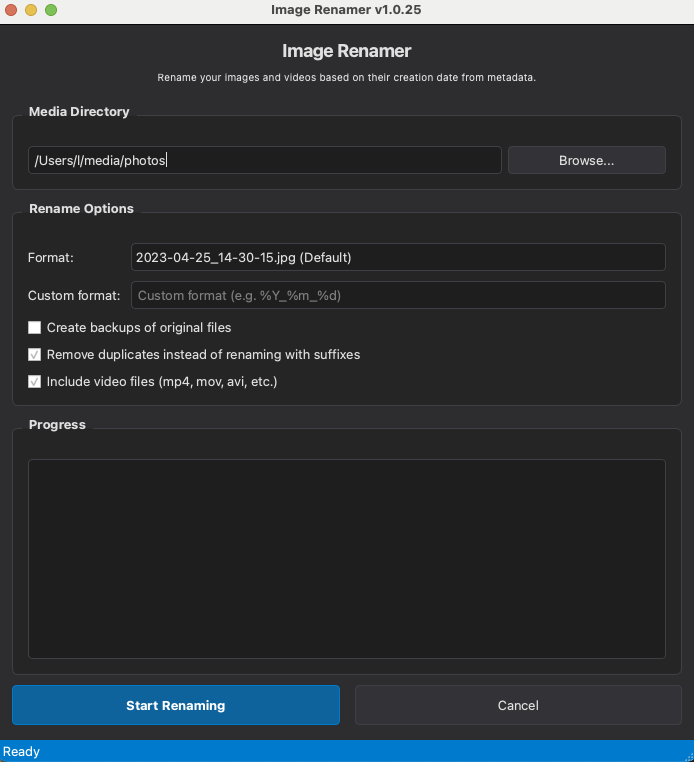

# Image Renamer

[](https://github.com/larsniet/image-renamer/actions/workflows/tests.yml)
[](https://codecov.io/gh/larsniet/image-renamer)
[](https://badge.fury.io/py/imagerenamer)
[](https://github.com/larsniet/image-renamer/releases)

A Python application that renames image files based on their creation date from EXIF metadata.

## Problem Solved

Digital cameras often reset their file numbering when SD cards are formatted, making it difficult to organize photos chronologically. This application automatically renames all images in a folder using their creation date and time from the metadata.

## Features

- Renames image files using the creation date from EXIF metadata
- Falls back to file creation time if no EXIF data is available
- Supports JPG, JPEG, PNG, NEF, CR2, and ARW file formats
- Optional backup of original files
- Customizable filename format
- Prevents duplicate filenames by adding a counter
- Beautiful and user-friendly GUI interface
- Remembers your previous settings

## Screenshots



## Requirements

- Python 3.6 or higher
- Pillow library (for reading EXIF data)
- PyQt6 (for the GUI version)

## Installation

### From Source

1. Clone this repository:
   ```bash
   git clone https://github.com/larsniet/image-renamer.git
   cd image-renamer
   ```

2. Install the package:
   ```bash
   pip install -e .
   ```

### From PyPI (coming soon)

```bash
pip install imagerenamer
```

## Usage

### GUI Application

There are several ways to launch the GUI:

```bash
# If installed via pip
imagerenamer-gui

# Or
python -m imagerenamer.gui

# Or from the source directory
./scripts/imagerenamer-gui
```

The GUI application provides an intuitive interface to:
- Select your image folder
- Choose from preset date formats or create a custom one
- Create backups of original files (optional)
- View real-time progress with a detailed log

### Command Line Interface

For command-line usage:

```bash
# If installed via pip
imagerenamer /path/to/images

# Or
python -m imagerenamer.cli /path/to/images

# Or from the source directory
./scripts/imagerenamer-cli /path/to/images
```

With backup option:

```bash
imagerenamer /path/to/images --backup
```

With custom filename format:

```bash
imagerenamer /path/to/images --format "%Y%m%d_%H%M%S"
```

### Command Line Arguments

- `folder`: Path to the folder containing images (required)
- `-b, --backup`: Create backup of original files
- `-f, --format`: Format string for the new filename (default: '%Y-%m-%d_%H-%M-%S')
- `-v, --version`: Show version information and exit

## Format String Options

The format string follows Python's `strftime()` format codes:

- `%Y`: 4-digit year (e.g., 2023)
- `%m`: 2-digit month (01-12)
- `%d`: 2-digit day (01-31)
- `%H`: 2-digit hour (00-23)
- `%M`: 2-digit minute (00-59)
- `%S`: 2-digit second (00-59)

Example formats:

- `%Y-%m-%d_%H-%M-%S` → 2023-04-25_14-30-15.jpg (default)
- `%Y%m%d_%H%M%S` → 20230425_143015.jpg
- `%Y-%m-%d_%Hh%Mm%Ss` → 2023-04-25_14h30m15s.jpg

## Project Structure

```
image-renamer/          # Project root
├── LICENSE             # MIT license file
├── README.md           # Project documentation
├── requirements.txt    # Dependencies
├── setup.py            # Package installation
├── pyproject.toml      # Modern Python packaging
├── imagerenamer/       # Main package
│   ├── __init__.py     # Package init
│   ├── core.py         # Core functionality
│   ├── cli.py          # Command-line interface
│   └── gui.py          # GUI interface
└── scripts/            # Entry points
    ├── imagerenamer-cli
    └── imagerenamer-gui
└── tests/              # Test suite
    ├── conftest.py     # pytest configuration
    ├── test_core.py    # Core functionality tests
    ├── test_cli.py     # CLI tests
    └── test_gui.py     # GUI tests
```

## Running Tests

The project includes a comprehensive test suite using pytest. To run the tests:

```bash
# Install test dependencies
pip install pytest pytest-cov

# Run the tests
pytest

# Run tests with coverage report
pytest --cov=imagerenamer
```

The test suite includes:
- Unit tests for core functionality
- Command-line interface tests
- GUI component tests (without launching the actual GUI)

## Releases

### Automated Builds

This project uses GitHub Actions to automatically build and release packages for Windows, macOS, and Linux. When a new release tag is pushed (e.g., `v1.0.0`), the following happens:

1. Tests are run on all supported platforms
2. A new GitHub Release is created
3. Binary packages are built for each platform:
   - Windows: Standalone `.exe` file (zipped)
   - macOS: Standalone `.app` bundle (zipped)
   - Linux: Standalone executable (tarball)
4. Python package is published to PyPI

### Creating a New Release

This project includes an automated release script to simplify the process:

#### Using the Release Scripts

**Only for macOS/Linux users:**
```bash
./release.sh 1.0.1
```

These scripts will:
1. Ensure you're on the main branch
2. Run tests to verify everything works
3. Update the version number in the code
4. Commit and push the version change
5. Create and push a Git tag
6. GitHub Actions will automatically build and publish the release

#### Manual Release Process

If you prefer to release manually:

1. Update the version in `imagerenamer/__init__.py`
2. Commit the change: `git commit -m "Bump version to X.Y.Z"`
3. Push to main: `git push origin main`
4. Create a tag: `git tag vX.Y.Z`
5. Push the tag: `git push origin vX.Y.Z`

### Manual Installation from Releases

You can download the latest binary release for your platform from the [Releases page](https://github.com/larsniet/image-renamer/releases).

- **Windows**: Extract the ZIP file and run `imagerenamer.exe`
- **macOS**: Extract the ZIP file, move `imagerenamer.app` to your Applications folder
- **Linux**: Extract the tarball and run the `imagerenamer` executable

## License

This project is licensed under the MIT License - see the [LICENSE](LICENSE) file for details. 